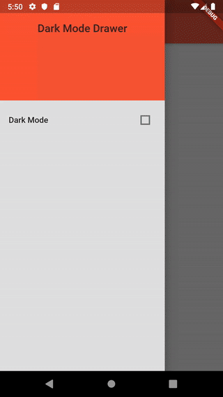

# Dark Mode

   This adds a setting in the main drawer to toggle the app's dark and light modes.
   I used [scoped model](https://pub.dev/packages/scoped_model) to change the app's theme by modifying the model as it's passed down through descendent widgets into the settings drawer, and I used [shared preferences](https://pub.dev/packages/shared_preferences) to track whether dark mode was enabled.

